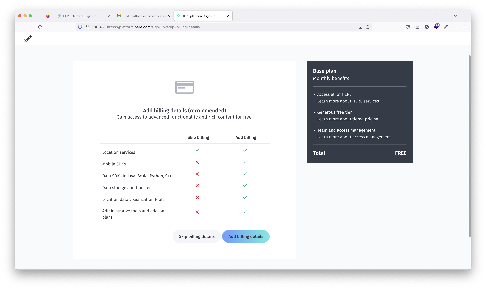
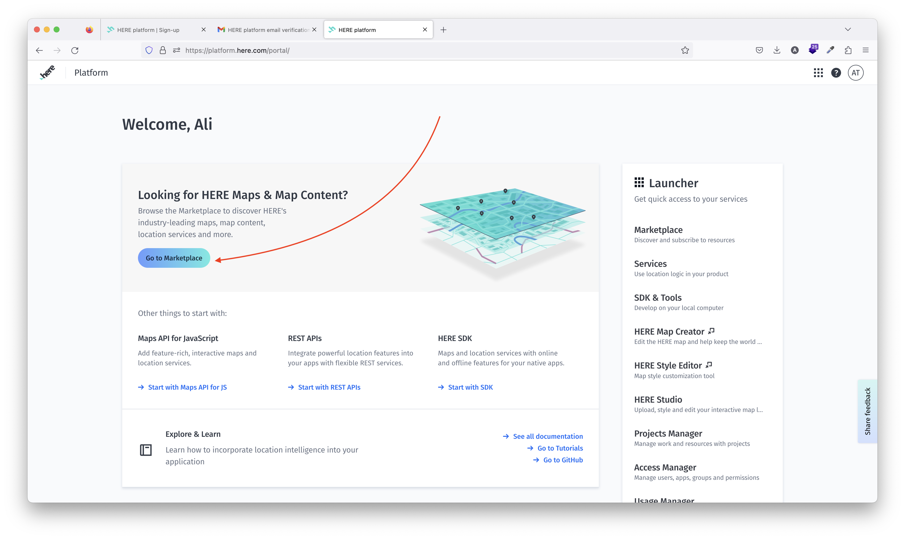
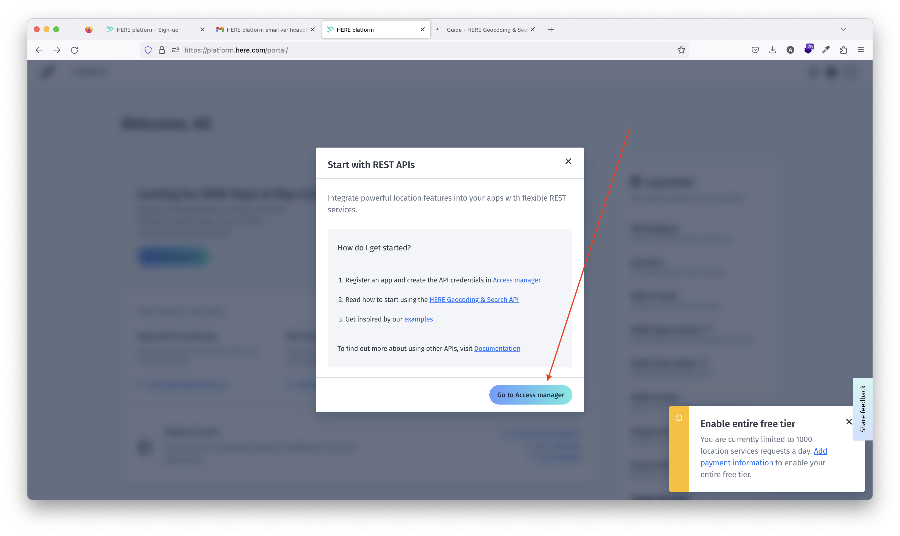
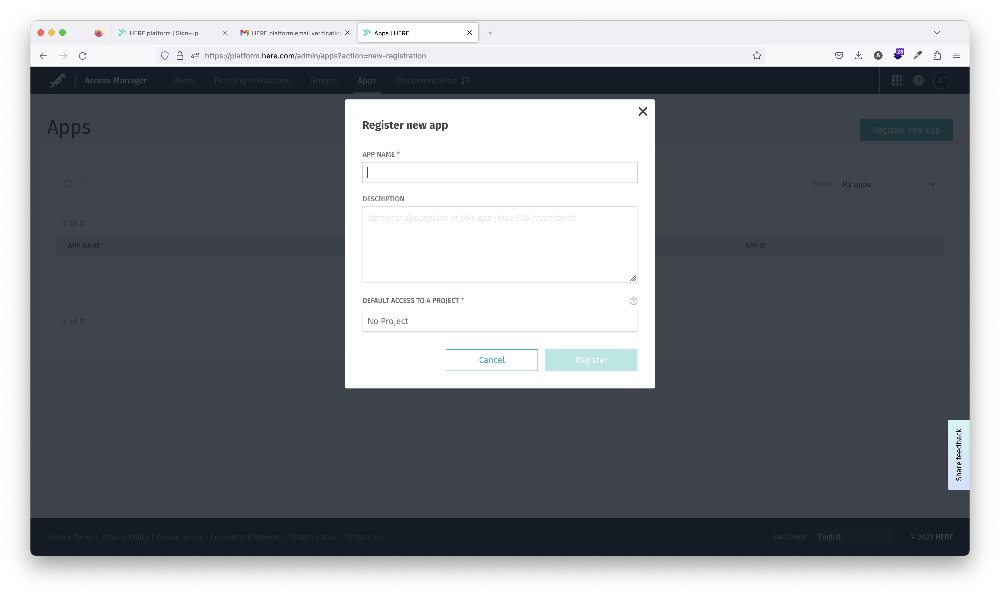
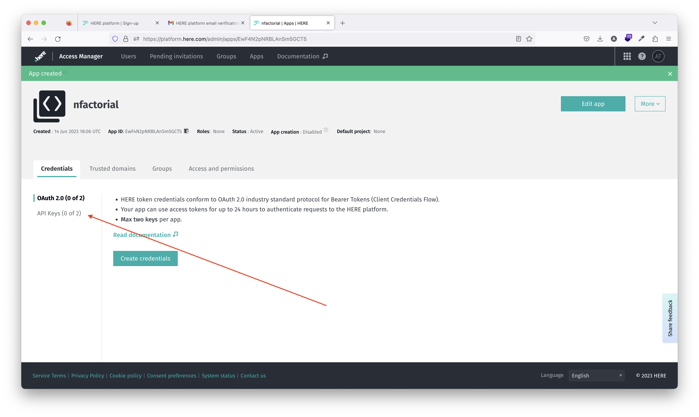
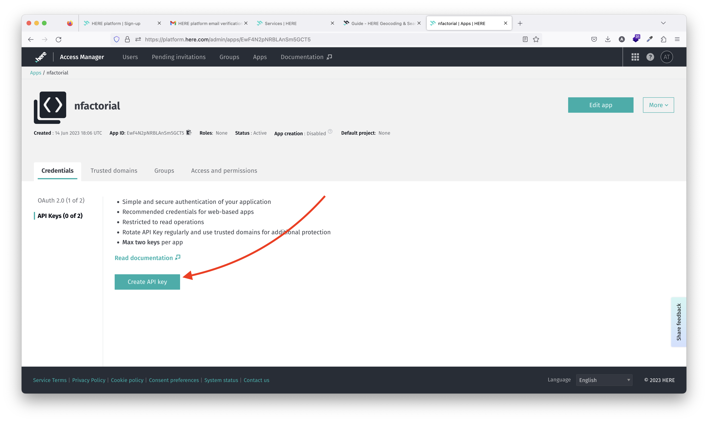

# Лекция 4

## 01. Заходим на here.com

## 02. Пропускаем шаг привязывания карты

В одном из шагов регистрации выбираем "Skip billing details".

## 03. Открывается панель

Нажмите на `Go to Markerplace`.

## 04. Открывается модалка

Нажмите на `Go to Access manager`

## 05. Настраиваем проект

Заполните необходимые данные, неважно на какие значения.

## 06. Откроется страница проекта

Переходи на `API Keys`

## 07. Создаем API ключ

Нажмите на `Create API key` и вам создастся ключ, сохраните его чтобы использовать у себя в API.

# Полезные ссылки

- [Документация here.com](https://developer.here.com/documentation/geocoding-search-api/dev_guide/topics/quick-start.html)
