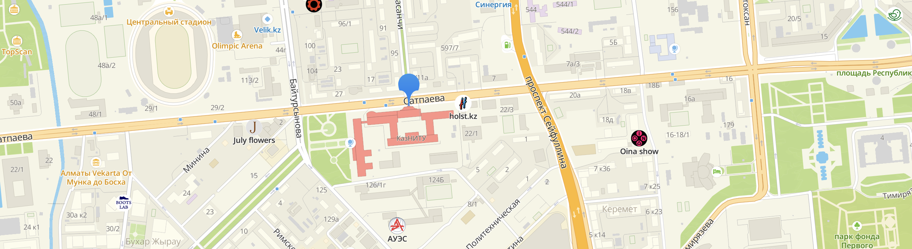

# Спринт №3: Координаты



Продукт "Şañıraq.kz" должен идти в ногу со временем и предоставлять инновационные решения пользователям.

В будущем мы хотим добавить поиск по локации на карте, поэтому нам важно добавить широту и долготу к каждому объявлению.

На данном спринте мы поработаем над добавлением новой фичи и также возьмем пару задач из беклога:

- Интеграция с `here.com`, для получения координат из адреса. В дальнейшем мы добавим поиск по ближайшим квартирам.
- Избранные объявления. Пользователи должны иметь возможность сохранить некоторые объявления, чтобы вернуться к ним позже.
- Аватар профиля пользователя. Пользователям важно иметь свою идентичность.

После завершения данного спринта разверните разработку на railway.

## ✅ Таск №1: Координаты жилого помещения

На предыдущих спринтах мы разрабатывали роут для создания объявления - `POST /shanyraks/`.

Нужно добавить функционал, чтобы перед добавлением объявления в базу данных, API получает координаты дома и прикрепляет широту и долготу
к объявлению.

Соответственно, нужно изменить ответ роута `GET /shanyraks/{id}`, чтобы добавить поле `location` как указано в примере ниже.

```http
HTTP/1.1 200 OK

{
    "_id": "507f191e810c19729de860ea",
    "address": "Астана, Алматы р-н, ул. Нажимеденова, 16 – Сарыколь",
    "..."
    "location": {
        "latitude": 43.23624,
        "longitude": 76.929851
    }
}
```

## ✅ Таск №2: Добавление в избранное

Пользователи должны иметь возможность добавлять объявления в избранное. Для этого предлагается создать новый роут `POST /auth/users/favorites/shanyraks/{id}`, где `{id}` - идентификатор объявления.

```http
POST /auth/users/favorites/shanyraks/{id} HTTP/1.1
Authorization: Bearer {token}
```

```http
HTTP/1.1 200 OK
```

## ✅ Таск №3: Получение списка избранных

Также пользователи должны иметь возможность просматривать свой список избранных объявлений. Создать роут `GET /auth/users/favorites/shanyraks` который вернет список избранных объявлений пользователя.

```http
GET /auth/users/favorites/shanyraks HTTP/1.1
Authorization: Bearer {token}
```

```http
HTTP/1.1 200 OK

{
    "shanyraks": [
        {
            "_id": "{shanyrak_id1}",
            "address": "Астана, Алматы р-н, ул. Нажимеденова, 16 – Сарыколь"
        },
        {
            "_id": "{shanyrak_id2}",
            "address": "{address2}"
        }
        "..."
    ]
}
```

## ✅ Таск №4: Удаление из избранного

Пользователь должен иметь возможность удалить объявление из списка избранных. Создать роут `DELETE /auth/users/favorites/shanyraks/{id}` для удаления объявления из списка избранных.

```http
DELETE /auth/users/favorites/shanyraks/{id} HTTP/1.1
Authorization: Bearer {token}
```

```http
HTTP/1.1 200 OK
```

## ✅ Таск №5: Загрузка аватара пользователя

Пользователи должны иметь возможность загружать свои аватары. Создать роут `POST /auth/users/avatar` для загрузки аватара пользователя.

```http
POST /auth/users/avatar HTTP/1.1
Authorization: Bearer {token}

avatar.png
```

```http
HTTP/1.1 200 OK
```

## ✅ Таск №6: Получение аватара пользователя

Добавить возможность просмотра аватара пользователя в ответ на запрос `GET /auth/users/me`. В ответе на этот запрос должен быть URL загруженного аватара пользователя.

```http
GET /auth/users/me HTTP/1.1
Authorization: Bearer {token}
```

```http
HTTP/1.1 200 OK

{
    "_id": "{user_id}",
    "email": "{почта текущего пользователя}",
    "phone": "+7 700 698 5025",
    "name": "Далида Е.",
    "city": "Алматы",
    "avatar_url": "https://{s3_service}/users/{user_id}/avatar.png"
}
```

## ✅ Таск №7: Удаление аватара пользователя

Пользователи должны иметь возможность удалить свой аватар. Создать роут `DELETE /auth/users/avatar` для удаления аватара пользователя.

Здесь следует учесть, что нужно удалить файл из S3 и удалить ссылку на файл в MongoDB.

```http
DELETE /auth/users/avatar HTTP/1.1
Authorization: Bearer {token}
```

```http
HTTP/1.1 200 OK
```
